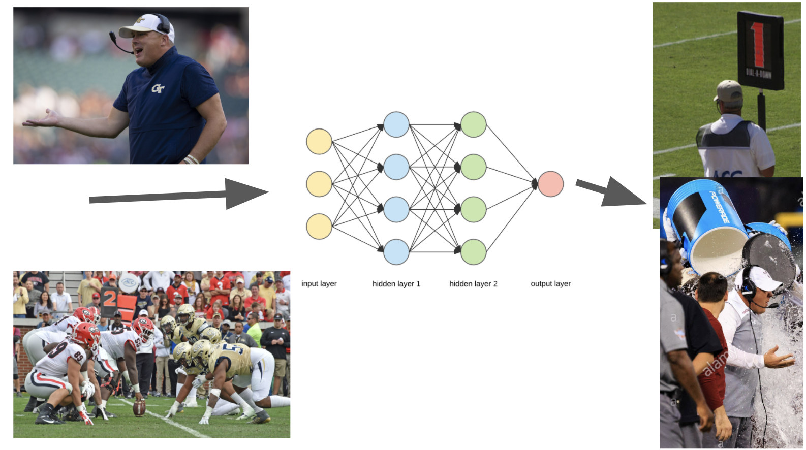

# Welcome to our CS 4641 Project
Group Members:
Daniel Mulloy, Steven McGaughey, William Hunnicutt, and Hunter Copp.

## Touch-points
### Touch-point 1 (September 28)
[Google Slides proposal](https://docs.google.com/presentation/d/1lqc4cYwl3FGDUaEJnqRbJutyHcS9bqcUW0vrNTv1BoU/edit?usp=sharing)  
[Pre-recorded video of proposal presentation](assets/proposal.mp4)

### Touch-point 2 (October 30)
[Google Slides](https://docs.google.com/presentation/d/1XUYmbQi7nxib7FvQSLl0j9Y02YbNeSqOa29q96LnnVE/edit?usp=sharing)  
[Pre-recorded video](assets/touch_point_2_video.mp4)

### Touch-point 3 (November 20)

## Midterm report (November 6)

For our project, we are trying to create a model that can predict the outcome of an NFL handoff on a given play. This would be able to help football analysts and coaches better decide what plays to run that give them the highest number of expected yards gained given the current situation.The data set came from Kaggle and includes data for each player on the field per play (682,154 total data points of run plays). Since there are 22 players on the field per play, this means we have 31,007 unique run plays in our data set. Our data also has 49 different features for each data point. We’ve faced some challenges with the project so far. When we first started, we were trying to predict yards for all plays, but there were 255 features. With this many features, someone trying to predict the outcome of a play would have to retrieve each of the 255 features per play before the play begins, which wasn’t realistic for real world applications. We were also really struggling with feature selection and deciding which features to use and which to filter out. Therefore we decided to use only run plays for our data. This eliminates many of the features that were only relevant to pass plays, kick offs, punt returns, etc.  
  
The problem of how many yards you can expect to gain on a given play is a regression problem. This is because we are judging the result of a play based on how many yards gained. The possible results of a play fall in the range of -100 yards (meaning a loss of 100 yards) to 100 yards (meaning a gain of 100 yards). Realistically though, a play will not lose more than about 5 yards most of the tim, and a run play will only gain more than 20 yards only a few times per game. Therefore, our range is technically \[-100, 100], but most plays will realistically fall under the interval of \[-5, 20].  
  
Before we implemented any learning methods, we wanted to get a feel for the distribution of yards gained per play. We created a histogram of bin length 1 yard and the y-axis being the number of times it occurred. This is shown in [Figure 1](assets/figure1.png). Looking at the histogram, we noticed that the distribution of yards gained follows a gaussian distribution with an average of 4.22 yards and a standard deviation of 6.44 yards. We found that 25% of the runs were a yard or less and 25% of the runs were over 6 yards. Therefore, we concluded that if a play gained less than -6.5 yards or more than 13.5 yards, it was an outlier. We had 31,007 unique plays and 1865 plays that we deemed were outliers. This computes to 6.012% of our data being outliers.  
  
Once we settled on the data set and were familiar with the distribution of yards, we then had to decide on what features to use. When choosing features, we wanted to choose the ones that had a direct correlation with yards gained. We also wanted to eliminate or combine features where it made sense to. To give an example of why we would eliminate a feature, we are given “Stadium” and “Location” as 2 different features. The stadium never changes where it is located, so the location feature is unnecessary to use. To give an example of why we would combine a feature, we are given “TimeSnap”, which is the time when the ball was snapped, and “TimeHandoff”, which is the time the ball was handed to the running back. We can combine these two features to its own feature that shows the amount of time taken between the snap and the handoff. This reduces the amount of features we would have to use. Lastly, we created a correlation matrix ([Figure 2](assets/figure2.png)) to see the relationship between the features in each data point. Looking at the correlation matrix, we can see that no features have any significant correlation to the play’s yardage gain (by themselves at least).  
  
Once we had determined our updated feature set, we began cleaning the data. With our dataset, we had 22 data points per play, one per player. We decided to remove all of them but the running back (for simplicity sake), as his location and biographical information was the most important. Each data point per play also had all the duplicate data about the overall play. Next, we took the columns with string values and replaced them with a unique integer for every string value. Lastly, we scaled/normalized the data, using scikit’s StandardScaler, which removed the mean and scaled by unit variance. This was done to help GMM not get influenced by insanely large numbers.  
  
After the data had been cleaned, we implemented PCA to find how many principal components the data had. The visualization for PCA is shown in ([Figure 3](assets/figure3.png)). When we ran PCA, we got that our data had 33 principal components that kept 99% variance. We then created a scree plot showing the proportion of variance for each principal component. The plot is shown in [Figure 4](assets/figure4.png). As you can see, the first 6 principal components have the highest proportion of variance, and then the graph starts to drop off. We would take these 6 principal components to be the most important in terms of affecting how many yards the play gained.  
  
We then wanted to implement GMM on the data. For GMM, in order to determine the number of clusters we wanted to use, we used scikit to find the silhouette scores for different numbers of clusters using the features we found to be important. The silhouette scores show us the optimal number of clusters we should use for our dataset. The results of the silhouette scores are shown in [Figure 5](assets/figure5.png) in the appendix. From this, we saw that 3 clusters gave us the highest silhouette score by far. We then ran GMM with 3 clusters shown in [Figure 6](assets/figure6.png). As you can see the clustering did not work very well with this data set. This would make sense because if you go back to the heat map, there weren’t too many features that had that strong of a correlation with other features. Therefore the data wasn’t able to cluster very well.  
  
In conclusion, since this is a regression problem and football plays are inherently similar and unpredictable, unsupervised learning did not work very well. GMM wasn’t very helpful because the feature points were relatively similar, so the data did not cluster well.  While we haven’t gotten very far in supervised learning yet, what we have started doing (neural network) seems to be more promising for prediction.

## Project proposal (October 2)

### Summary Figure

### Introduction/Background
Problem: The outcome of a football play is considered to be very unpredictable. The factors that go into it (weather, positions, remaining yards, etc) make it hard for a coach to judge in the moment which plays will allow the team to get the yards needed to succeed.  
Motivation: Being able to model the number of yards that will be gained by a play will yield a team a competitive advantage.  
Goal: To model the number of yards that will be gained in an NFL play based on the situation.  
Disclaimer: For simplicity, we will not be including field goals, and for punts, we will model the number of yards gained after the ball is recieved.

### Dataset 
For our project, we plan on using a [play by play dataset](https://www.kaggle.com/maxhorowitz/nflplaybyplay2009to2016) of NFL plays from recent years. The dataset contains roughly 100 columns of data of varying levels of importance.

### Unsupervised Approaches
For our unsupervised approach, we plan on running GMM. Ideally we will find clusters for gaining and not gaining yards. We will also probably have to do some dimensionality reduction.

### Supervised Approaches
We plan on applying a Neural Net, Decision Tree/Random Forest, and Linear Regression techniques. We also plan on using PCA for dimensionality reduction as well. From there, we will compare the performance of the six approaches and pick the best one. We will select a portion of the data as a training set and the rest will be used for testing. 

### Results
We would like to predict the amount of yard gain/loss based on a play's stats.

### Discussion
The best reasonable outcome would be for us to model 90% of plays successfully, where a successful model is defined as one that we get within 10% of the yards gained or lost.

### References
[References PDF](assets/references.pdf)  
Ota, Karson. “Football Play Type Prediction and Tendency Analysis.” Massachusetts Institute of Technology, June 2017, dspace.mit.edu/bitstream/handle/1721.1/113120/1016455954-MIT.pdf.  
Teich, Brendan, et al. “NFL Play Predictio.” Research Gate, University of Massachusetts Amherst, Jan. 2016, www.researchgate.net/publication/289406746_NFL_Play_Prediction.  
Young, Chris. “Applying Machine Learning to Predict BYU Football Play Success.” Medium, Towards Data Science, 6 July 2020, https://towardsdatascience.com/applying-machine-learning-to-predict-byu-football-play-success-60b57267b78c.  

Future dates:
Midterm report (November 6)
Final report (Demeber 7)
