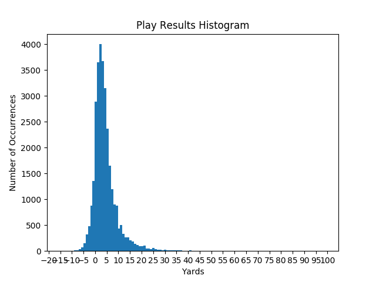

# CS 4641 Group 26
Group Members:
Daniel Mulloy, Steven McGaughey, William Hunnicutt, and Hunter Copp.

## Touch-points
### Touch-point 1 (September 28)
[Google Slides proposal](https://docs.google.com/presentation/d/1lqc4cYwl3FGDUaEJnqRbJutyHcS9bqcUW0vrNTv1BoU/edit?usp=sharing)  
[Pre-recorded video of proposal presentation](assets/proposal.mp4)

### Touch-point 2 (October 30)
[Google Slides](https://docs.google.com/presentation/d/1XUYmbQi7nxib7FvQSLl0j9Y02YbNeSqOa29q96LnnVE/edit?usp=sharing)  
[Pre-recorded video](assets/touch_point_2_video.mp4)

### Touch-point 3 (November 20)
[Google Slides](https://docs.google.com/presentation/d/1azkIXxq7cwaeWjRAsN18MyXlp62RFgxlQOlzit0q0TQ/edit#slide=id.ga6ac8435e2_0_276)  
[Pre-recorded video](assets/touch_point_3_video.mp4)

# Final report (December 7)
For our project, we are trying to create a model that can predict the outcome of an NFL handoff on a given play. This would be able to help football analysts and coaches better decide what plays to run that give them the highest number of expected yards gained given the current situation.

## Dataset
The dataset came from Kaggle and includes data for each player on the field per play (682,154 total data points of run plays). Since there are 22 players on the field per play, this means we have 31,007 unique run plays in our data set. Our data also has 49 different features for each data point. We’ve faced some challenges with the project so far. When we first started, we were trying to predict yards for all plays, but there were 255 features. With this many features, someone trying to predict the outcome of a play would have to retrieve each of the 255 features per play before the play begins, which wasn’t realistic for real-world applications. We were also really struggling with feature selection and deciding which features to use and which to filter out. Therefore we decided to use only run plays for our data. This eliminates many of the features that were only relevant to pass plays, kickoffs, punt returns, etc.

## Problem
The problem of how many yards you can expect to gain on a given play is a regression problem. This is because we are judging the result of a play based on how many yards gained. The possible results of a play fall in the range of -100 yards (meaning a loss of 100 yards) to 100 yards (meaning a gain of 100 yards). Realistically though, a play will not lose more than about 5 yards most of the time, and a run play will only gain more than 20 yards only a few times per game. Therefore, our range is technically [-100, 100], but most plays will realistically fall under the interval of [-5, 20].

Before we implemented any learning methods, we wanted to get a feel for the distribution of yards gained per play. We created a histogram of bin length 1 yard and the y-axis being the number of times it occurred. This is shown in Figure 1. Looking at the histogram, we noticed that the distribution of yards gained follows a gaussian distribution with an average of 4.22 yards and a standard deviation of 6.44 yards. We found that 25% of the runs were a yard or less and 25% of the runs were over 6 yards. Therefore, we concluded that if a play gained less than -6.5 yards or more than 13.5 yards, it was an outlier. We had 31,007 unique plays and 1865 plays that we deemed were outliers. This computes to 6.012% of our data being outliers.

